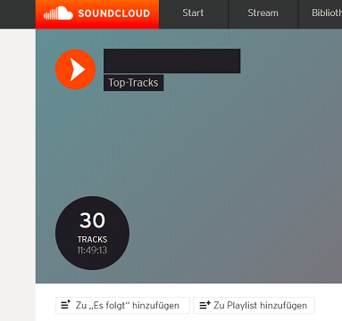

# Soundcloud Artist's Top-Tracks - Get Soundcloud UserID from UserprofileID
Soundcloud stores a page called "Top-Tracks" for some userprofiles.

Why does soundcloud.com does not provide to their customers a direct link to the top-tracks of any soundcloud-userprofile, you only get a few suggestions based on your profile at the soundcould landing page. 

Using soundcloud a lot discovering new music a wanted to simply get the link to it as reason for creating this repo. Please feel free to fork me and/or contact me to keep up the development of this overdue feature.

*Convert Soundcloud UserprofileID to UserID* 
The trick is to get the Soundcloud UserprofileID from the UserID trhough an http call to the soundcloud user's webpage.

      http://soundcloud.com/userprofileID
      http://www.soundcloud.com/discover/sets/introducing:userID
      
  For example this crab is working

>       (1) http://soundcloud.com/lobster-theremin
>       (2) Right-Click -> view:source -> search for string "user:<userID>" -> concat string to top-track url
>       (3) http://www.soundcloud.com/discover/sets/introducing:44297755

After a few tries I ended up with an PowerShell script and my first .net-Forms. 
I would like to have an Browser-Addon for that, which displays the top-tracks link on top of each profile page. Let me know if you made some cool stuff :) I would appreciate it.

PS: ExecutionPolicy off

[toptracks.PNG]:data:image/png;base64,iVBORw0KGgoAAAANSUhEUgAAAn0AAAJXCAYAAADmROKdAAAAAXNSR0IArs4c6QAAAARnQU1BAACxjwv8YQUAAAAJcEhZcwAAEnQAABJ0Ad5mH3gAAP+lSURBVHhe7L0JuG1HWeZvO7Z2tyLOigJBbFu7aUVRZpAxCYQhEAZlhgwEEqYAxgAJgdxzCSQhISDIIJMQRGaV4ASNAiJTHJgUWtQoKCLEoRP+6Kn/+32r3lpVX32r9lp773tzbm6d53mfd/9qrbXPPnufk
